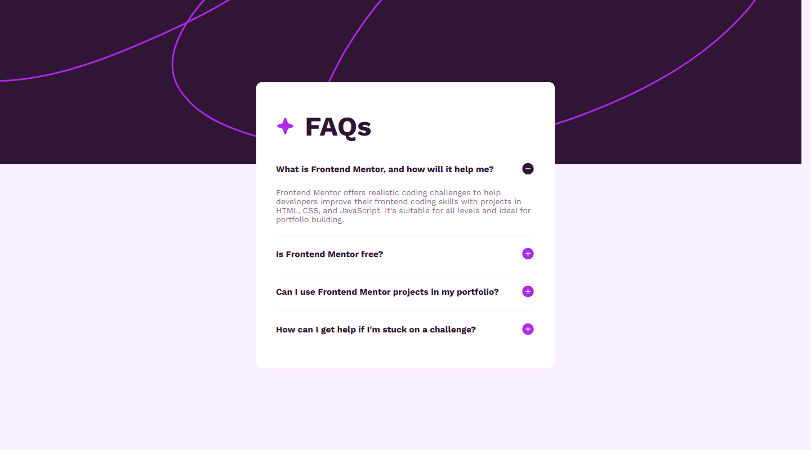
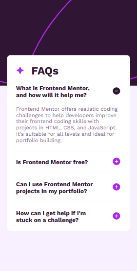

# Frontend Mentor - Recipe page solution

This is a solution to the [Recipe page challenge on Frontend Mentor](https://www.frontendmentor.io/challenges/recipe-page-KiTsR8QQKm). Frontend Mentor challenges help you improve your coding skills by building realistic projects. 

## Table of contents

- [Overview](#overview)
  - [The challenge](#the-challenge)
  - [Screenshot](#screenshot)
  - [Links](#links)
- [My process](#my-process)
  - [Built with](#built-with)
  - [What I learned](#what-i-learned)
  - [Continued development](#continued-development)
  - [Useful resources](#useful-resources)
- [Author](#author)
- [Acknowledgments](#acknowledgments)

**Note: Delete this note and update the table of contents based on what sections you keep.**

## Overview

### Screenshot

**Note: Delete this note and the paragraphs above when you add your screenshot. If you prefer not to add a screenshot, feel free to remove this entire section.**

### Links

- Solution URL: [solution URL](https://github.com/torekuislam/Frontend-Mentor/tree/master/faq-accordion-main)
- Live Site URL: [live site URL](https://eloquent-twilight-f27e77.netlify.app/)

## My process

### Built with

- Semantic HTML5 markup
- CSS custom properties
- Mobile-first workflow
- js

**Note: These are just examples. Delete this note and replace the list above with your own choices**

### What I learned

Responsive Design: Developed skills in creating responsive layouts for various screen sizes.

HTML and Semantic Structure: Applied semantic HTML elements for improved accessibility and document structure.

CSS Styling: Gained experience in styling with CSS.
Javascript: js classlist and mash more.

## Author

- Git Hub - [@torekulislam](https://github.com/torekuislam)
- LinkedIn -[@torekulislam](https://www.linkedin.com/in/torekul-islam-72748b335/)

