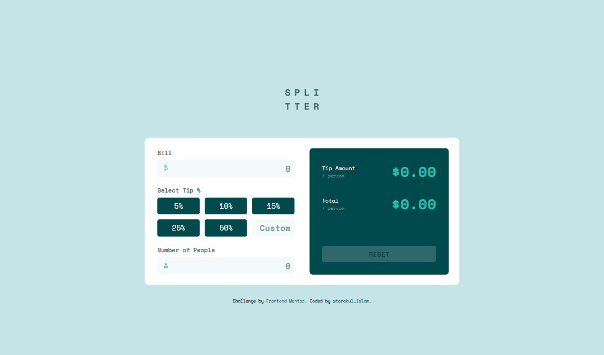

# Frontend Mentor - Recipe page solution

This is a solution to the [Recipe page challenge on Frontend Mentor](https://www.frontendmentor.io/challenges/recipe-page-KiTsR8QQKm). Frontend Mentor challenges help you improve your coding skills by building realistic projects. 

## Table of contents

- [Overview](#overview)
  - [The challenge](#the-challenge)
  - [Screenshot](#screenshot)
  - [Links](#links)
- [My process](#my-process)
  - [Built with](#built-with)
  - [What I learned](#what-i-learned)
  - [Continued development](#continued-development)
  - [Useful resources](#useful-resources)
- [Author](#author)
- [Acknowledgments](#acknowledgments)

**Note: Delete this note and update the table of contents based on what sections you keep.**

## Overview

### Screenshot

**Note: Delete this note and the paragraphs above when you add your screenshot. If you prefer not to add a screenshot, feel free to remove this entire section.**

### Links

- Solution URL: [solution URL](https://github.com/torekuislam/Frontend-Mentor/tree/master/tip-calculator-app-main)
- Live Site URL: [live site URL](https://creative-crostata-03d2d5.netlify.app/)

## My process

### Built with

- Semantic HTML5 markup
- CSS custom properties
- Flex
- Grid
- Mobile-first workflow

### What I learned

Responsive Design: Developed skills in creating responsive layouts for various screen sizes.

HTML and Semantic Structure: Applied semantic HTML elements for improved accessibility and document structure.

CSS Styling: Gained experience in styling with CSS.

<!-- ### Useful resources

- [Udemy Webdevlopment](https://www.udemy.com/share/101W9C3@2s1lShiGH32a3OJHMYullps9bvMmvxO_kykXK5ZGloqkGQDHawnryvbZtrMeQ8y81A==/) 

**Note: Delete this note and replace the list above with resources that helped you during the challenge. These could come in handy for anyone viewing your solution or for yourself when you look back on this project in the future.** -->

## Author

- Git Hub - [@torekulislam](https://github.com/torekuislam)
